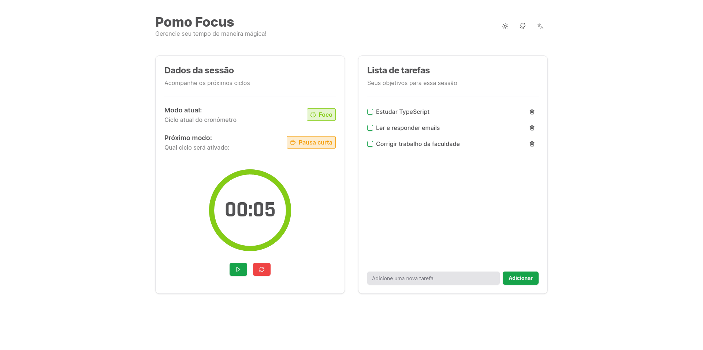

# PomoFocus

[](https://github.com/gildembergleite/pomo-focus)
[](https://github.com/vercel/next.js/)
[](https://github.com/tailwindlabs/tailwindcss)
[](https://github.com/shadcn/ui)
[](https://opensource.org/licenses/MIT)

## Descrição

O PomoFocus é uma aplicação baseada na técnica Pomodoro, projetada para melhorar a gestão do tempo e aumentar a eficiência. Além do temporizador Pomodoro, a aplicação inclui uma seção de lista de tarefas, permitindo que os usuários listem as atividades nas quais desejam se concentrar e concluir.

## Tecnologias Utilizadas

- NextJS 14
- TypeScript
- TailwindCSS
- shadcn/ui

## Metodologias

- Context API do React
- Hooks personalizados para utilizar os providers dos contextos
- Theme provider para adicionar funcionalidade de tema escuro e claro

## Captura de Tela



## Como Clonar o Repositório

Siga os passos abaixo para clonar o projeto:

1. Abra o terminal e navegue até o diretório em que deseja clonar o projeto.

```bash
cd /seu/diretorio/de/escolha
```

2. Clone o repositório usando o seguinte comando:

```bash
git clone https://github.com/gildembergleite/pomo-focus.git
```

3. Navegue para o diretório do projeto:

```bash
cd pomo-focus
```

4. Instale as dependências do projeto:

```bash
npm install
# ou
yarn install
```

5. Inicie a aplicação localmente:

```bash
npm run dev
# ou
yarn dev
```

Agora você pode acessar a aplicação em [http://localhost:3000](http://localhost:3000).

## Licença

Este projeto é licenciado sob a [Licença MIT](LICENSE).